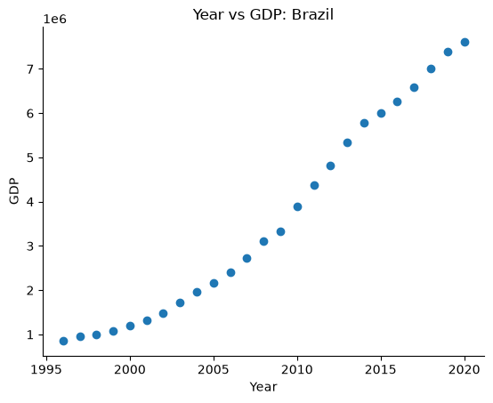
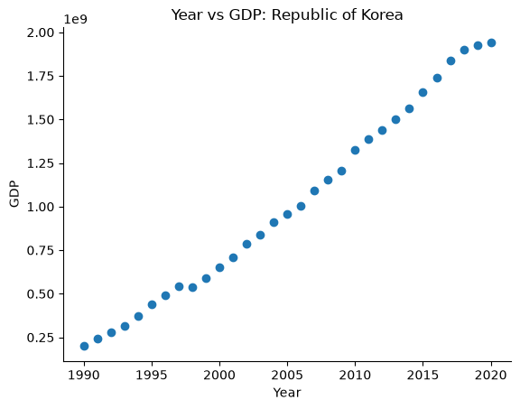
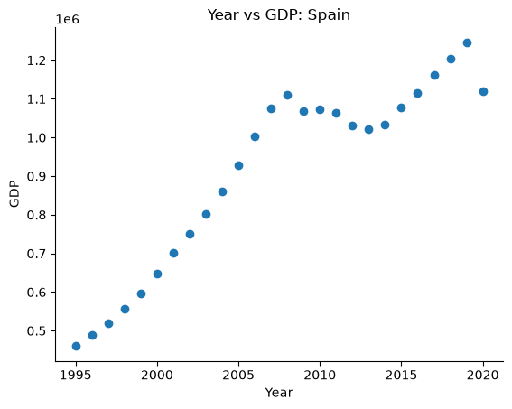
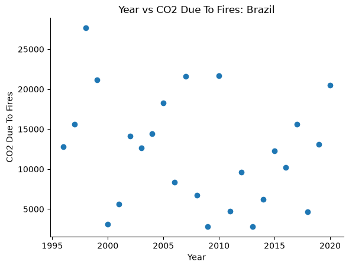
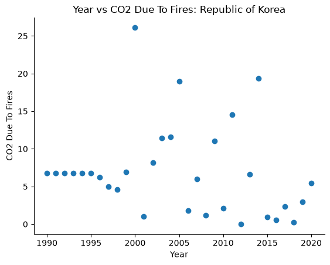
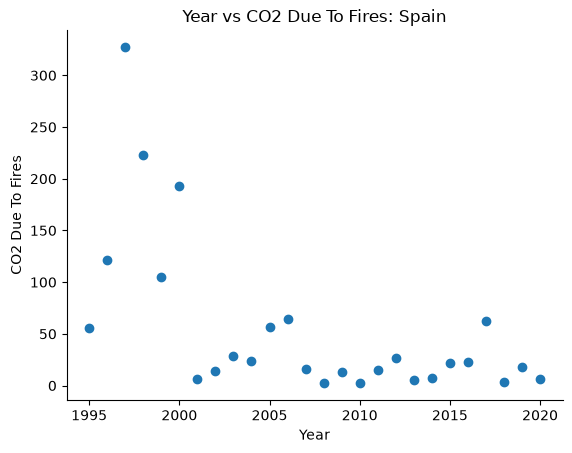
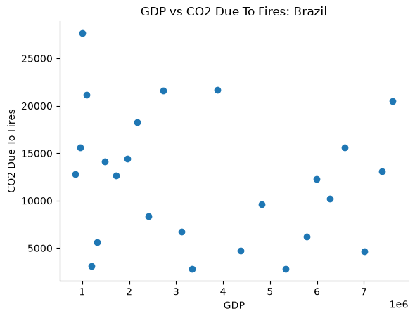
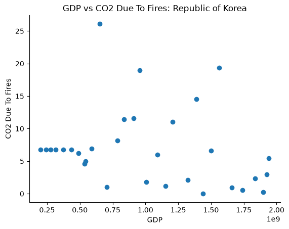
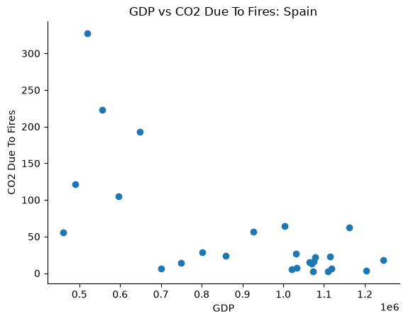

# Test-Driven Development Sample

This repository is meant to demonstrate the power of test driven development by creating a data visualization tool for 2 data sets: Agrofood CO2 Emission and Country GDP curated by the IMF.

To download the data used for yourself, run the following code:

```
curl -L "https://docs.google.com/uc?export=download&id=1AsXP_OGs1O_TDeXiZjk3fYV1SrG4vwXF" -o data/Agrofood_co2_emission.csv
curl -L "https://docs.google.com/uc?export=download&id=19YEPysdnK7VCXuAe9Og9pwYkNT5CbQzr" -o data/IMF_GDP.csv
```

## Analysis

I performed a few analyses of the GDP/Fires data. Fistly, I chose three countries with dramatically different environments and yet similar GDPs. From the World Bank (https://data.worldbank.org/indicator/NY.GDP.MKTP.CD?most_recent_value_desc=true), I was able to tell that Brazil, Spain, and the Republic of Korea (South Korea) all had comparable GDPs when converted to USD, but they have very different climates and sizes. South Korea is an incredibly densly populated, small country that industrialized relatively recently. Spain is an old European colonial power. The majority of Brazil is taken up by the largest rainforest in the world. I thought that comparing their GDP growth vs forest fire CO2 emissions may be interesting.





Notably, Brazil and South Korea have monotonically increasing GDPs as compared to Spain, which was hit comparatively hard by the 2008 Global Financial Crisis. That would follow a rudimentary interpretation that the South Korean and Brazilian economies rely more on manufactured goods to bouy their GDP, which export relatively well as demand for manufactured goods is relatively inelastic. Of course, we are perfectly capable of doing without, but relatively inelastic is compared to a more service and property oriented economy like Spain. 

One thing to note: although the GDP scales are incomparable due to differences in currency, a metric known as Purchasing Power Parity scales economies based on how many standard goods and services can be bought in the local economy with the local currency. While particularly useful when comparing defense spending between countries, we can use it here as well. According to the World Bank, (https://data.worldbank.org/indicator/NY.GDP.MKTP.PP.CD?most_recent_value_desc=true), South Korea and Spain actually have very close PPPs, but Brazil outpaces them significantly. Such is the advantage of having an economy where it is less expensive to buy goods and services.






Even though we couldn't compare the scales of GDP between countries, we can compare CO2 emissions. The differences are stark. The much larger Brazil has orders of magnitude more forest fire emissions than either of the other countries, and the urbanized South Korea is even beaten by Spain, which used up its old growth forests hundreds of years ago. Notably, we can see no obvious patterns in the data beyond Spain's obvious reduction in emissions.





Finally, a comparison between CO2 emissions and GDP. There is no obvious pattern from the data. I organized it as such because GDP monotonically increases for two of the countries we are comparing, making the graphs look similar to our Fires vs Time charts. There may be a slight decline in emissions in Brazil, but GDP may not be the leading cause. Reductions in the number of forrests and global environmental regulations may impact these numbers. While increasing GDP may increase the efficacy of the local forest service to fight and control fires, it is not strongly supported from the data here that there is a causal link. Korea has no link between fires and GDP, but the small penninsula's low surface area leads to high variance in the number of fires per year, obscuring data. While Spain shows a clear correlation between CO2 emissions from fires and GDP, it also is the only country to experience an economic downturn in the timeframe given. Comparing the Emissions vs Time and Emissions vs GDP presents a stronger case that Time is the key variable to reducing fires, not wealth. If there was a direct causal link, we would expect a jump in CO2 emissions around 2008, which we do not see.